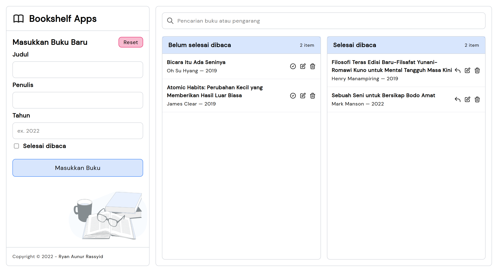

# Bookshelf Apps
Sebuah Web Apps yang dibuat sebagai syarat kelulusan Dicoding Submission [Belajar Membuat Front-End Web untuk Pemula](https://www.dicoding.com/academies/315).

## Tech
Project ini menerapkan materi yang telah dipelajari pada Materi di kelas yang sudah saya sebutkan diatas. Yaitu Project ini sudah:

- Memanipulasi Document Object Model (DOM) menggunakan Native Javascript.
- Menerapkan fitur Browser Object Model (BOM) dengan contoh fitur `confirm` delete buku.
- Menyimpan data menggunakan `localStorage`.
- Tersedia fitur Pencarian buku berdasarkan judul dan pengarang.
- Tersedia fitur Edit buku.
- Menggunakan package [`notyf`](https://github.com/caroso1222/notyf) untuk menampilkan toast / alert message.

## Screenshot


## How to Start
Untuk memulai development silahkan install dependency yang dibutuhkan dengan menggunakan Package Manager (hanya untuk tahap Development). Saya pribadi menggunakan PNPM, namun kalian bisa install menggunakan NPM atau Yarn walaupun tanpa package-lock.json atau yarn-lock.json.

```bash
# menggunakan PNPM
$ pnpm i
# menggunakan NPM
$ npm i
# menggunakan Yarn
$ yarn
```

### Start Development
Karena project ini menggunakan SCSS maka kita perlu compiler untuk merubah syntax SCSS ke CSS. Untuk menjalankan watcher kita perlu penjalan perintah:

```bash
$ npm run watch
```

Maka secara otomatis ketika kita merubah atau sedang mengedit file `*.scss` akan dicompile menjadi file `*.css`.

